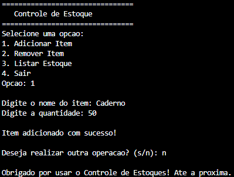

# Controle-de-Estoques-em-C
Este projeto consiste em um controle de estoques desenvolvido em C, projetado para oferecer controle de mercadorias via terminal. O sistema utiliza uma interface de menu, permitindo que o usuário controle a movimentação de itens e monitore o armazenamento de forma rápida e direta pelo terminal.

<p align = "left">

</p>

## Demonstração



Interface do Controle de Estoques em execução no terminal.

## Instalação e Pré-requisitos

### Pré-requisitos

- Compilador C compatível com o padrão C99 ou superior;
- Terminal ou prompt de comando para executar o programa;
- Sistema operacional Windows, Linux ou macOS.

### Passos para Instalar

1. Baixe ou clone o projeto;
2. Compile o código.

## Usos e Exemplos

Após baixar ou clonar o projeto, siga os passos abaixo para compilar e executar o jogo no terminal.

### Compilar o Código

No Windows, abra o terminal e digite:

```
gcc main.c -o ControleEstoque.exe
```

No Linux/macOS:

```
gcc main.c -o ControleEstoque
```

### Executando o Jogo:

No Windows:

```
ControleEstoque.exe
```

No Linux/macOS:

```
./ControleEstoque
```

## Como Utilizar

1. O usuário escolhe uma opção de operação (1 a 4) no menu exibido no terminal;
2. Caso escolha a operação (1), o usuário digita o nome do item e sua quantidade para ele ser adicionado no estoque;
3. Caso escolha a operação (2), o usuário digita o nome do item e sua quantidade para ele ser removido do estoque;
4. Caso escolha a operação (3), o programa lista o estoque, e informa caso estiver vazio;
5. Caso escolha a operação (4), o programa termina.


## Estrutura do Projeto

```
Calculadora-Baseada-em-Texto-C/
├── assets/
│   └── Controle-de-Estoques-Terminal.png
├── main.c
├── LICENSE
└── README.md
```

## Licença 

Este projeto está licenciado sob a MIT License - veja o arquivo [LICENSE](LICENSE) para mais detalhes. 
